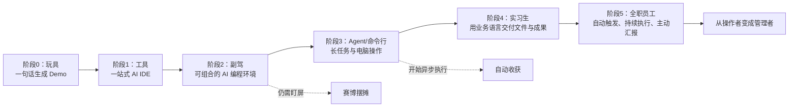

# AI 编程：从工具到数字员工

> 类型：演讲 / 课程学习资料  
> 时长：约 46 分钟  
> 主题：AI 编程的六个阶段、从“帮你做”到“替你做”、数字员工岗位化  
> 📌 来源：[原始逐字稿](/Users/mac/.codex/attachments/6ace9289-4476-45f8-9d50-eb027ef3e762/pasted-text.txt)  
> 说明：工具名称按语境校正为 Cursor、VS Code、Claude Code、Cowork、OpenClaw；个别名称仍可能受转写误差影响。案例与数据均为演讲者自述，未经外部核验。

---

## 一、先记住这句话

这场演讲真正讨论的不是“AI 能不能写代码”，而是：

> 如何把 AI 从一个需要你时时操作的工具，变成能够按岗位说明书持续交付结果的数字员工。

其商业含义是：

- **摆摊卖时间**：人在，产出才在；人停，业务就停。
- **售货机卖系统**：人不在场，系统仍然持续工作、交付甚至赚钱。
- AI 做得快，不等于业务已经自动化；**自动化需要系统、触发机制、验收标准和异常升级机制**。

演讲者把 AI 编程称为“普通人最后的阶梯”，本质上是把它看作一种低成本生产力杠杆：普通人雇不起几十名员工，但可以训练多个 AI 岗位协同工作。

---

## 二、全场逻辑地图



能力演进伴随着三次“消失”：

1. **IDE 消失**：从图形化编程环境进入命令行 Agent。
2. **代码消失**：用户用业务语言布置工作，AI 自选技术方案，交付 PPT、Excel、报告等结果。
3. **电脑消失**：用户用手机发任务，AI 自动执行、汇报和告警。

---

## 三、AI 编程六阶段拆解

| 阶段 | 角色比喻 | 典型形态 | 核心能力 | 主要局限 | 通关关键 |
|---|---|---|---|---|---|
| 0 | 玩具 | 网页式生成工具 | 几句话生成官网、小游戏、原型 | 难做复杂产品，难精确控制 | 对技术原理产生兴趣，理解 Demo 背后怎样工作 |
| 1 | 工具 | Cursor 等一站式 AI IDE | 门槛低、上手快，能做商业产品 | 大项目上下文与复杂度容易失控；使用成本可能上升 | 学会拆解工具链，不再只依赖一站式封装 |
| 2 | 副驾 | VS Code + 多种 AI 插件 | 可自由组合，能驾驭复杂项目，上限高 | 仍需全程盯屏；处理代码外业务不够方便 | 理解 CLI/Agent 更适合长任务和跨工具工作 |
| 3 | Agent | Claude Code 等命令行工具 | 可跑长任务；可操作电脑；不只写代码 | 多数任务仍需手动启动，仍要阶段性盯屏 | 让任务具备自动触发、自动找活和自动验收能力 |
| 4 | 实习生 | Cowork 类业务执行环境 | 用业务语言交代工作；AI 自选方案并交付真实文件 | 不懂技术原理时难发挥上限；常需手动触发 | 当自动触发任务多于手动任务，开始建设数字岗位 |
| 5 | 全职员工 | OpenClaw/“小龙虾”类系统 | 手机布置任务；自动触发；持续执行；及时汇报 | 决策仍需人拍板；不能触碰物理世界；不擅长大量微决策 | 暂无明确下一阶段，重点转为组织设计与决策治理 |

### 关键分水岭

前三阶段的核心是 **AI 帮你做**；后三阶段开始进入 **AI 替你做**。

- “帮你做”：你是操作者，AI 提升你的单次执行效率。
- “替你做”：你是管理者，负责定义岗位、分配目标、验收结果和处理例外。

因此，AI 编程越往后，最重要的能力越不像传统编程，越像管理学。

---

## 四、最重要的方法论：选岗位，不选任务

### 1. 区分任务与岗位

- **任务**：“帮我写一篇公众号文章。”它是一次性的，需要人发起。
- **岗位**：“每天 8 点收集指定资讯，按我的偏好选题，完成写作、排版和发布；异常时向我报告。”它由多个任务串联、周期性执行。

判断一个工作是否已成为岗位，可以问五个问题：

1. 它是否重复出现？
2. 它是否有稳定输入和明确产出？
3. 它是否能设定质量标准？
4. 它是否有固定或事件型触发条件？
5. AI 遇到例外时，是否知道何时继续、何时请示？

### 2. 写“岗位说明书”

不要先想复杂的 Agent 编排。把 AI 当成一名能力很强、但不了解你业务的新实习生，写一份他能执行的说明书。

岗位说明书至少写清：

```markdown
# 岗位名称

## 岗位目标
这个岗位最终为谁创造什么结果？

## 触发条件
- 固定时间：每天/每周何时执行
- 事件触发：出现什么变化立即执行

## 输入
- 数据、文件、网址、账号、历史样例

## 工作步骤
1. 做什么
2. 怎么做
3. 使用哪些资料和工具

## 交付物
- 输出格式
- 保存位置
- 命名规则

## 验收标准
- 每一步怎样才算完成
- 哪些错误不可接受
- 用什么数据判断好坏

## 权限边界
- 可以自主决定什么
- 哪些情况必须请示
- 哪些动作必须人工批准

## 汇报机制
- 正常完成如何汇报
- 异常如何告警
- 日报/周报包含什么
```

### 3. 用“带实习生”的方式调教

演讲者给出的训练节奏是：

1. 先让 AI 完整跑一遍。
2. 人在旁边观察，记录具体错误。
3. 把纠错规则写回岗位说明书，而不是只在对话里临时提醒。
4. 重复运行 3—5 遍。
5. 连续观察一周；稳定后才视为岗位外包成功。
6. 后续以验收产出、处理例外为主。

这里的“养 AI”不是反复聊天，而是持续完善流程、标准、样例和边界。

---

## 五、数字员工适合做什么

演讲中的能力边界定义很有用：

> 一个极聪明的人，给他一台电脑以后能完成的工作，大体就是当前数字员工可覆盖的上限。

### 适合优先自动化

- 高频、重复、电脑内完成的工作
- 输入相对稳定、输出易验收的工作
- 信息搜集、比较、整理和监控
- 有日志、数据库或行为数据可用的工作
- 能以固定时间或明确事件触发的工作
- 失败后容易回滚、人工复核成本较低的工作

### 暂不适合完全交给 AI

- 必须进入物理世界的工作
- 涉及大量审美微调和连续微决策的工作
- 高风险、不可逆、责任重大的决策
- 深度用户交流、组织关系和现场连接
- 目标本身模糊、连人都说不清怎样算好的工作

---

## 六、演讲中的典型业务案例

### 1. 自动化图文自媒体

完整链路可包含：资讯收集 → 按个人偏好选题 → 写稿 → 排版 → 发布 → 数据复盘。

演讲者建议把它作为第一个数字岗位，因为：

- 每个单项技能不算高深；
- 输出一眼可验收；
- 能较快跑通端到端闭环；
- 适用于公众号、小红书、X/Twitter 等平台。

### 2. 自动优化产品

数字员工持续读取用户行为、服务器日志和数据库数据，发现问题后完成分析、修改、测试和上线准备。传统流程可能跨运维、产品、研发、测试多个岗位；Agent 系统尝试把它串成闭环。

### 3. 自动日报

记录当天沟通、任务完成情况、配置变化和反思，写入 Notion 或飞书。价值不只在汇报，更在于给数字员工形成持续复盘和改进记录。

### 4. 事件告警

监控订单异常、服务器故障、负载风险等事件，通过飞书消息甚至电话提醒管理者。关键不是“提醒越多越好”，而是逐步校准告警阈值，减少噪声。

### 5. 竞品监控

数字员工可每天：

- 实际操作竞品并比较功能变化；
- 追踪 Reddit、X/Twitter 等平台的用户反馈；
- 监控价格、站点结构、关键词和运营动作；
- 从技术痕迹推测尚未正式发布的功能。

这类岗位初期调教成本较高，但一旦稳定，可显著减少长期人工巡检。

### 6. 从想法到可收款网站

演讲中的案例声称，数字员工可从选择和购买域名开始，继续写代码、部署、接入支付、测试并上线。它体现的是端到端执行能力，而不是单点代码生成。

---

## 七、管理学才是后半程的核心

演讲把 Prompt Engineering 和 Context Engineering 统一理解为管理问题：

- Prompt：怎样把工作交代清楚。
- Context：怎样把相关背景、历史、约束和资料提供完整。
- Agent 编排：怎样分工、协作和交接。
- Evaluation：怎样验收员工产出。
- Guardrails：怎样规定权限、红线与升级机制。

换句话说，技术能力决定你能否搭起系统；管理能力决定系统能否长期稳定地替你工作。

### 人的角色如何变化

```text
亲自执行 → 描述目标 → 设计流程 → 定义标准 → 分配权限 → 验收结果 → 处理例外
```

这也带来一个新瓶颈：当 AI 产出速度远高于人的审阅速度，老板可能从“执行过载”转为“决策过载”。

演讲者的后续修正是：

- AI 负责大量执行；
- 人类负责人承担部分判断和结果责任；
- 最终决策权按风险和业务边界分层下放。

“AI 干活，人类做选择”不是让人更轻松的自动保证；如果所有选择都集中到一个人身上，仍会形成新的管理瓶颈。

---

## 八、值得警惕的三个误区

### 误区 1：AI 很快，所以已经自动化

如果每次都要你打开电脑、发起任务、盯住过程，它仍然只是效率更高的“赛博摆摊”。真正自动化至少需要触发器、状态记录、验收和异常处理。

### 误区 2：小白直接用最高阶工具就能跳级

演讲者用自动驾驶与驾照、计算器与数学基础类比：高阶工具替你隐藏了过程，但你仍需理解基本技术原理，否则无法判断结果、排查失败或发挥上限。

更准确地说，不一定要先成为传统程序员，但必须逐步建立：文件、命令行、接口、权限、数据、日志、测试和部署等基本心智模型。

### 误区 3：数字员工可以完全替代人

演讲后半段其实主动修正了“今年不招人类员工”的激进判断。AI 缺少物理世界能力，也会制造大量待决策事项；组织仍需要人承担创造、关系、责任和取舍。

---

## 九、适合普通人的 7 天实践路线

### 目标

不要一开始追求“AI 公司”，只跑通一个低风险、可验收、周期性执行的小岗位。

### Day 1：盘点候选岗位

记录最近两周重复做过的电脑工作，按以下维度各打 1—5 分：

- 重复频率
- 耗时
- 规则清晰度
- 输出可验收度
- 出错风险（反向计分）

优先选择总分高且风险低的一个。

### Day 2：写岗位说明书

写清目标、输入、步骤、交付物、验收标准、权限边界和汇报方式。准备 2—3 个优秀样例和 1—2 个反例。

### Day 3：人工触发第一遍

让 AI 完整执行。不要一出现小错误就接管；先记录它在哪一步理解错、缺了什么上下文。

### Day 4：修改流程并复跑

把问题固化进说明书、检查清单或样例库，再执行第二、第三遍。

### Day 5：增加自动触发

设置固定时间或事件触发，同时明确失败重试、超时和告警规则。

### Day 6：增加自动验收

让 AI 在交付前按检查清单自检，并输出证据：数据来源、检查结果、失败项和不确定项。

### Day 7：复盘是否值得长期运行

评估：

- 节省了多少人工时间？
- 人工审阅耗时多少？
- 错误率与风险是否可接受？
- 最常见异常是什么？
- 下一步应该扩大范围，还是先继续调教？

---

## 十、6 要素提取

### A. 认知 / 观点

- AI 编程的终点不是更快地亲自写，而是让 AI 持续替你工作。
- 快不等于自动化；自动化是一套脱离操作者仍能持续产生结果的系统。
- AI 编程的高阶能力，本质上越来越接近管理学。
- 普通人的杠杆来自“卖系统”，而非不断提高个人卖时间的速度。
- AI 执行能力越强，人的瓶颈越可能从执行能力转向决策能力。

### B. 方法论

- 六阶段进阶：玩具 → 工具 → 副驾 → Agent → 实习生 → 全职员工。
- 从任务自动化升级为岗位自动化：选岗位、写说明书、试跑、纠错、稳定运行。
- 用“能否自动触发”区分实习生式工具与全职数字员工。
- 用“目标—步骤—标准—权限—汇报”五部分管理 Agent。
- 用 3—5 次试跑加一周稳定性观察完成岗位训练。

### C. 故事 / 数据

- 演讲者称现场 AI 编程使用率一年内从约 10% 升至约 70%—80%。
- 演讲者举例：一名学员独立做小程序，三个月收入 100 多万元。
- OpenKonnect 作者 Peter 被观察到一天以本人名义提交 600 多次代码。
- 演讲者称一篇 200 元付费公众号文章售出约 700 单、收入十几万元。
- 演讲者称自己二月在外两三周，只因系统故障打开过一次电脑，业务仍有增长。
- 傅盛案例中，AI 运营公众号后单篇达到数万阅读，X/Twitter 内容据称获得 100 多万访问。

> 注：上述数字均为演讲者现场自述，学习时应把它们视为案例线索，而非已经审计的事实。

### D. 情绪表达 / 金句

- “摆摊卖时间，售货机卖系统。”
- “AI 做事当然很快，但快不等于自动化。”
- “你的 AI 是在帮你做事，还是替你做事？”
- “你要选的是岗位，而不是任务。”
- “AI 干活，人类只做选择，而做选择就是你的创造过程。”
- “把重复的工作交给 AI，省下来的时间放在需要人类智慧的事情上。”

### E. 可发展的选题

- 为什么会用 AI，不代表你已经拥有自动化系统？
- 从赛博摆摊到自动售货机：AI 创业真正的分水岭。
- 不要先学 Agent 编排，先给 AI 写一份岗位说明书。
- 数字员工越多，老板为什么反而越心累？
- AI 替代的不是一个人，而是一段跨部门流程。
- 普通人的第一个数字员工，为什么适合从内容岗位开始？

### F. 待办

- [ ] 盘点最近两周重复发生的电脑工作，选出一个低风险候选岗位。
- [ ] 按模板完成该岗位的岗位说明书。
- [ ] 准备优秀样例、反例和验收清单。
- [ ] 连续试跑 3—5 遍，每次把错误固化为流程规则。
- [ ] 增加定时或事件触发机制。
- [ ] 连续观察一周，记录节省时间、错误率与人工审阅成本。

---

## 十一、复习题

1. “AI 帮你做”和“AI 替你做”的关键区别是什么？
2. 为什么说快不等于自动化？一套自动化系统至少需要哪些要素？
3. 六阶段中，IDE、代码和电脑分别在哪种能力变化中“消失”？
4. 为什么岗位说明书比单次 Prompt 更重要？
5. 什么样的工作适合先交给数字员工？什么样的工作不适合？
6. 怎样验证一个数字岗位已经稳定，而不是偶然成功一次？
7. 当 AI 带来决策过载时，组织应该怎样重新分配权力和责任？

---

## 十二、一页纸行动清单

```text
找重复工作
  ↓
选一个低风险、易验收的岗位
  ↓
写清目标、输入、步骤、标准、权限、汇报
  ↓
准备优秀样例与反例
  ↓
完整试跑，不急着接管
  ↓
把错误写回 SOP
  ↓
重复 3—5 遍
  ↓
增加自动触发、自检与异常告警
  ↓
连续稳定一周
  ↓
人从执行者转为验收者和决策者
```

真正值得追求的不是“我会不会用某个最新工具”，而是：**我能否把一项业务工作定义清楚、交给 AI 稳定执行，并用可控成本持续获得结果。**
